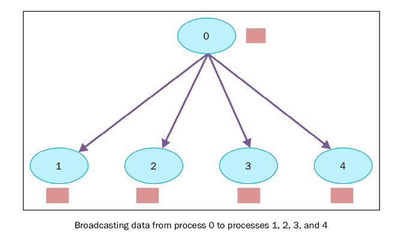
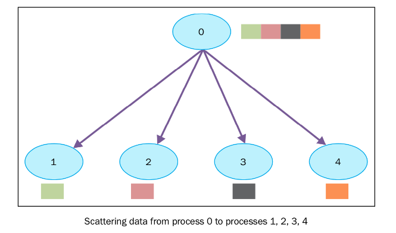
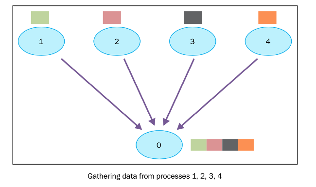

# mpi4py 的安装以及初步使用

## 在 macOS 系统上安装mpi4py并测试

1. 安装`homebrew`
2. 在终端中运行命令 `brew install open-mpi` 安装 `open-mpi`
3. 在终端中运行命令 `conda install mpi4py` 安装 `mpi4py`
4. 测试:新建第一个名为 `hello_parallel.py` 的 python 文件, 输入以下内容:

```python
from mpi4py import MPI 

comm = MPI.COMM_WORLD
rank = comm.Get_rank()
print("hellow world parallel, rank = ", rank)
```
在终端中输入
```
mpiexec -n 4 python hello_parallel.py
```
来运行 `hello_parallel.py` 文件, 返回以下结果
```
hellow world parallel, rank =  0
hellow world parallel, rank =  2
hellow world parallel, rank =  3
hellow world parallel, rank =  1
```
表示已经安装并运行成功.

在 MPI 中, 并行程序中不同进程用一个非负的整数来区别, 叫做rank. 如果我们有p个进程, 那么rank会从 0 到 p-1 分配。MPI 中获取 rank 的函数为 `comm.Get_rank()`

这个函数返回调用他的进程的 rank.

## 点对点通讯
两个不同的进程之间可以通过点对点通讯交换数据:一个进程是接收者,一个进程是发送者.

`mpi4py` 通过以下两个函数实现了点对点通讯:

- `Comm.Send(data, process_destination)` 发送数据给指定进程.

- `Comm.Recv(process_source)` 从源进程接收数据.

点对点通讯点代码示例: 创建 `python` 文件 `point_to_point.py`
```python
from mpi4py import MPI

comm = MPI.COMM_WORLD
rank = comm.rank
print("my rank is : ", rank)

if rank == 0: 
    # 发送者进程, rank 0 的进程发送数据给 rank4 进程.
    data = 10000
    destination_process = 4 
    comm.send(data, dest = destination_process) # 发送数据,需要指定接收者的rank
    print("sending data % s " % data + "to process % d" % destination_process)

if rank == 1: 
    # 发送者进程, rank 1 的进程发送数据为 rank7 进程.
    destination_process = 7 
    data = "hello"
    comm.send(data, dest = destination_process)
    print("sending data % s :" % data + "to process % d" % destination_process)

if rank == 4: 
    # 接收者进程, 从 rank 0 进程接收数据.
    data = comm.recv(source = 0) # 接收数据,需要指定发送者的rank.
    print("data received is = % s" % data)


if rank == 7: 
    # 接收者进程, 从 rank 1 进程接收数据.
    data1 = comm.recv(source = 1)
    print("data received is = % s" % data1)
```
设置最大进程数为8来运行文件
```
mpiexec -n 8 python point_to_point.py
```
得到如下运行结果:
```
my rank is :  4
my rank is :  6
my rank is :  5
my rank is :  2
my rank is :  3
my rank is :  7
my rank is :  0
sending data 10000 to process  4
data received is = 10000
my rank is :  1
sending data hello :to process  7
data received is = hello
```

总的来说,整个点对点通讯过程分为两部分,发送者发送数据,接收者接收数据,二者必须都指定发送方/接收方.

## 死锁

当两个或多个进程都在阻塞并等待对方释放自己想要的资源的情况,会面临死锁, 程序员必须遵守一定当编码的规则, 来避免死锁问题.

下面的代码中介绍了一种典型的死锁问题

```python
rank = comm.rank
print("my rank is : " , rank)

if rank==1:
    data_send= "a"
    destination_process = 5
    source_process = 5
    data_received=comm.recv(source=source_process)
    comm.send(data_send,dest=destination_process)
    print("sending data %s " %data_send + "to process %d" %destination_process)
    print("data received is = %s" %data_received)

if rank==5:
    data_send= "b"
    destination_process = 1
    source_process = 1
    data_received=comm.recv(source=source_process)
    comm.send(data_send,dest=destination_process)
    print("sending data %s :" %data_send + "to process %d" %destination_process)
    print("data received is = %s" %data_received)
```

运行这个程序会发现两个进程都无法完成. 会发生这种情况是因为MPI的 comm.recv() 函数和 comm.send() 函数都是阻塞的. 它们的调用者都在等待它们完成. 对 comm.send() MPI来说, 只有数据发出之后函数才会结束, 对于 comm.recv() 函数来说, 只有接收到数据函数才会结束. 为了避免死锁, 通常有两种方法, 第一种将上面代码修改如下：

```python
rank = comm.rank
print("my rank is : " , rank)

if rank==1:
    data_send= "a"
    destination_process = 5
    source_process = 5
    comm.send(data_send,dest=destination_process)
    data_received=comm.recv(source=source_process)
    print("sending data %s " %data_send + "to process %d" %destination_process)
    print("data received is = %s" %data_received)

if rank==5:
    data_send= "b"
    destination_process = 1
    source_process = 1
    comm.send(data_send,dest=destination_process)
    data_received=comm.recv(source=source_process)
    print("sending data %s :" %data_send + "to process %d" %destination_process)
    print("data received is = %s" %data_received)
```

或者使用`Sendrecv` 函数, 这个函数统一了向一特定进程发消息和从一特定进程接收消息的功能, 
```python
Sendrecv(self, sendbuf, int dest=0, int sendtag=0, recvbuf=None, int source=0, int recvtag=0, Status status=None)
```
可以将之前的程序发送和接收的过程直接改写如下：

``` python 
if rank==1:
    data_send= "a"
    destination_process = 5
    source_process = 5
    data_received=comm.sendrecv(data_send,dest=destination_process,source =source_process)

if rank==5:
    data_send= "b"
    destination_process = 1
    source_process = 1
    data_received=comm.sendrecv(data_send,dest=destination_process, source=source_process)
```
## 集体通讯

在并行代码的开发中，我们会经常发现需要在多个进程间共享某个变量运行时的值，或操作多个进程提供的变量（可能具有不同的值)。


### 使用 broadcast 函数进行通讯

 

将所有进程变成通讯者的这种方法叫做集体交流. 因此, 一个集体交流通常是2个以上的进程. 我们也可以叫它广播—— 一个进程发送消息给其他的进程. `mpi4py` 模块通过以下的方式提供广播的功能：

```python
buf = comm.bcast(data_to_share, rank_of_root_process)
```

具体使用方式如下: 我们有一个root进程, rank 等于0, 保存自己的数据 variable_to_share, 以及其他定义在通讯组中的进程.

```python
from mpi4py import MPI

comm = MPI.COMM_WORLD
rank = comm.rank

if rank == 0:
    data_to_share = "hellow world"
else:
    data_to_share = None
data_to_share = comm.bcast(data_to_share, root=0)

print("process id % d" % rank + " data shared % s" % data_to_share)
```
运行结果如下:
```
process id  0 data shared hellow world
process id  1 data shared hellow world
process id  2 data shared hellow world
process id  3 data shared hellow world
process id  4 data shared hellow world
process id  5 data shared hellow world
process id  6 data shared hellow world
process id  7 data shared hellow world
```

### 使用 scatter 函数进行通讯
`scatter` 函数和 `broadcast` 函数很像, 但是有一个很大的不同, `comm.bcast` 将相同的数据发送给所有在监听的进程, `comm.scatter` 可以将数据放在数组中, 发送给不同的进程. 下图展示了`scatter`函数的功能：

 

`comm.scatter` 函数接收一个`array`, 根据进程的`rank`将其中的元素发送给不同的进程. 比如第一个元素将发送给进程0, 第二个元素将发送给进程1, 等等. `mpi4py` 中的函数原型如下:

```python
recvbuf  = comm.scatter(sendbuf, rank_of_root_process)
```

下面程序是使用 `scatter` 函数的示例:

```python
from mpi4py import MPI 

comm = MPI.COMM_WORLD
rank = comm.rank

if rank == 0: 
    array_to_share = [1, 2, 3, 4, 5, 6, 7, 8]
else: 
    array_to_share = None 
recvbuf = comm.scatter(array_to_share, root=0)
print("process id % d" % rank + " recvbuf = % d " % recvbuf)
```


得到以下输出结果:

```
process id  0 recvbuf =  1
process id  1 recvbuf =  2
process id  2 recvbuf =  3
process id  3 recvbuf =  4
process id  4 recvbuf =  5
process id  6 recvbuf =  7
process id  7 recvbuf =  8
process id  5 recvbuf =  6
```
需要注意的是, comm.scatter 有一个限制, 发送数据的列表中元素的个数必须和接收的进程数相等. 举个例子, 如果列表中的个数比进程数多, 就会报错.

### 使用 gather 函数进行通讯

 

`gather` 函数是反向的 `scatter` 函数, 即收集所有进程发送向root进程的数据. `mpi4py` 实现的 `gather` 函数如下:

```python
recvbuf = comm.gather(sendbuf, rank_of_root_process)
```

`sendbuf` 表示要发送的数据, `rank_of_root_process` 表示要接收数据的进程

接下来的例子中实现上图表示的过程. 每一个进程都构建自己的数据, 发送给root进程(rank为0).


```python
from mpi4py import MPI

comm = MPI.COMM_WORLD

rank = comm.Get_rank()
size = comm.Get_size()

data = (rank + 1) ** 2
data = comm.gather(data, root=0)

if rank == 0:
    print ("rank = %s " %rank + "...receiving data from other process")
    print(data)
    for i in range(1, size):
        data[i] = (i+1)**2
    print(data)
```

输出结果如下:

```
rank = 0 ...receiving data from other process
[1, 4, 9, 16]
[1, 4, 9, 16]
```

# 对 NumPy 数组使用 MPI

## 点对点通信

如果需要传递和接收一个`NumPy`数组,需要把之前的`send`函数替换为`Send`,将`recv`函数替换为`Recv`.

```python
from mpi4py import MPI
import numpy as np 

comm = MPI.COMM_WORLD

size = comm.size
rank = comm.rank

if rank == 0: 
    data = np.arange(10, dtype = np.float64)
    comm.Send(data, dest = 1, tag = 13)

elif rank == 1: 
    data = np.empty(10, dtype = np.float64)
    print("rank of current process is % d" % rank)
    print("data before recv", data)
    recv = comm.Recv(data, source = 0, tag = 13)
    print("data after recv", data)
```

## 集体通信

### Bcast 函数

<font color = #ff0000> 这里需要注意的是,当使用 MPI 传递 NumPy 数组的时候,必须指定 NumPy 数组的数据类型. </font>

```python
from mpi4py import MPI
import numpy as np 

comm = MPI.COMM_WORLD
rank = comm.rank 

if rank == 0: 
    data = np.arange(100, dtype = np.float64)
else:
    data = np.empty(100, dtype = np.float64)

comm.Bcast(data, root = 0)

print("rank of current process is % d" % rank + "\n" + "data is", data, "\n")
```

使用两个进程运行该程序得到如下结果:

```
rank of current process is  0
data isrank of current process is  1
data is [ 0.  1.  2.  3.  4.  5.  6.  7.  8.  9. 10. 11. 12. 13. 14. 15. 16. 17.
 18. 19. 20. 21. 22. 23. 24. 25. 26. 27. 28. 29. 30. 31. 32. 33. 34. 35.
 36. 37. 38. 39. 40. 41. 42. 43. 44. 45. 46. 47. 48. 49. 50. 51. 52. 53.
 54. 55. 56. 57. 58. 59. 60. 61. 62. 63. 64. 65. 66. 67. 68. 69. 70. 71.
 72. 73. 74. 75. 76. 77. 78. 79. 80. 81. 82. 83. 84. 85. 86. 87. 88. 89.
 90. 91. 92. 93. 94. 95. 96. 97. 98. 99.]

 [ 0.  1.  2.  3.  4.  5.  6.  7.  8.  9. 10. 11. 12. 13. 14. 15. 16. 17.
 18. 19. 20. 21. 22. 23. 24. 25. 26. 27. 28. 29. 30. 31. 32. 33. 34. 35.
 36. 37. 38. 39. 40. 41. 42. 43. 44. 45. 46. 47. 48. 49. 50. 51. 52. 53.
 54. 55. 56. 57. 58. 59. 60. 61. 62. 63. 64. 65. 66. 67. 68. 69. 70. 71.
 72. 73. 74. 75. 76. 77. 78. 79. 80. 81. 82. 83. 84. 85. 86. 87. 88. 89.
 90. 91. 92. 93. 94. 95. 96. 97. 98. 99.]
```


### Scatter 函数

用 Scatter 函数传递 NumPy 数组时, 会将 NumPy 数组按照行传递到每一个处理器上, 其余操作同正常的 scatter函数, 如下所示:

```python
from mpi4py import MPI 
import numpy as np 

comm = MPI.COMM_WORLD 
size = comm.size
rank = comm.rank 

if rank == 0:
    sendbuf = np.arange(size * 10, dtype = np.float64).reshape(size, 10)
else:
    sendbuf = None

recvbuf = np.empty(10, dtype = np.float64)
comm.Scatter(sendbuf, recvbuf, root = 0)

print("rank of current process is : % d" % rank + " data is : ", recvbuf)
```

使用 4 进程运行以上程序得到如下结果:

```
rank of current process is :  0 data is :  [0. 1. 2. 3. 4. 5. 6. 7. 8. 9.]
rank of current process is :  1 data is :  [10. 11. 12. 13. 14. 15. 16. 17. 18. 19.]
rank of current process is :  2 data is :  [20. 21. 22. 23. 24. 25. 26. 27. 28. 29.]
rank of current process is :  3 data is :  [30. 31. 32. 33. 34. 35. 36. 37. 38. 39.]
```

### Gather 函数

```python 
from mpi4py import MPI
import numpy as np

comm = MPI.COMM_WORLD
size = comm.size
rank = comm.rank

colsize = 10
sendbuf = np.arange(colsize, dtype=np.float64) + 10 * rank

recvbuf = None
if rank == 0:
    recvbuf = np.empty((size, colsize), dtype=np.float64)

comm.Gather(sendbuf, recvbuf, root=0)

print("rank of current process is % d" % rank + "\n recvbuf is : \n", recvbuf)
```
使用 4 进程运行以上程序得到以下结果:

```
rank of current process is  0
 recvbuf is :
rank of current process is  1
 recvbuf is :
 None
rank of current process is  2
 recvbuf is :
 None
rank of current process is  3
 recvbuf is :
 None
 [[ 0.  1.  2.  3.  4.  5.  6.  7.  8.  9.]
 [10. 11. 12. 13. 14. 15. 16. 17. 18. 19.]
 [20. 21. 22. 23. 24. 25. 26. 27. 28. 29.]
 [30. 31. 32. 33. 34. 35. 36. 37. 38. 39.]]
```

- 练习: 输入一个 1D NumPy 数组, 使用并行的方式将数组里的每个元素进行平方.

```python 
from mpi4py import MPI
import numpy as np 

# 利用并行的方式将 arr 中的所有元素进行平方
def parallel_ele_square(arr):
    # 先将元素进行分组, 对于 i % size == r, 则将 arr[i] 分配到第 r 个处理器上.
    comm = MPI.COMM_WORLD
    rank = comm.rank 
    size = comm.size
    if rank == 0:
        data_to_share = []
        # 这里先只考虑 数组长度充分长的情况, 不考虑如果数组长度 < size 怎么, 需要再改进.
        for i in range(size):
            data_to_share.append(arr[i::size])
    else:
        data_to_share = None
    # 利用 scatter 函数将数据发配到每个处理器上
    recvbuf = comm.scatter(data_to_share, root = 0)
    print("process id is % d; " % rank + " data is ", recvbuf)
    square_data = recvbuf ** 2
    square_data = comm.gather(square_data, root = 0)
    if rank == 0: 
        res = np.empty(arr.shape)
        print("receiving data : ", square_data, "from other process ...")
        # 将数据在 process 0 上合并
        for i in range(size):
            res[i::size] = square_data[i]
        return res
    else: 
        res = None
if __name__ == "__main__":
    a = parallel_ele_square(np.arange(20))
    print(a)
```

使用三个处理器运行该程序,得到如下结果：

```
process id is  0;  data is  [ 0  3  6  9 12 15 18]
process id is  1;  data is  [ 1  4  7 10 13 16 19]
None
process id is  2;  data is  [ 2  5  8 11 14 17]
None
receiving data :  [array([  0,   9,  36,  81, 144, 225, 324]), array([  1,  16,  49, 100, 169, 256, 361]), array([  4,  25,  64, 121, 196, 289])] from other process ...
[  0.   1.   4.   9.  16.  25.  36.  49.  64.  81. 100. 121. 144. 169.
 196. 225. 256. 289. 324. 361.]
```
